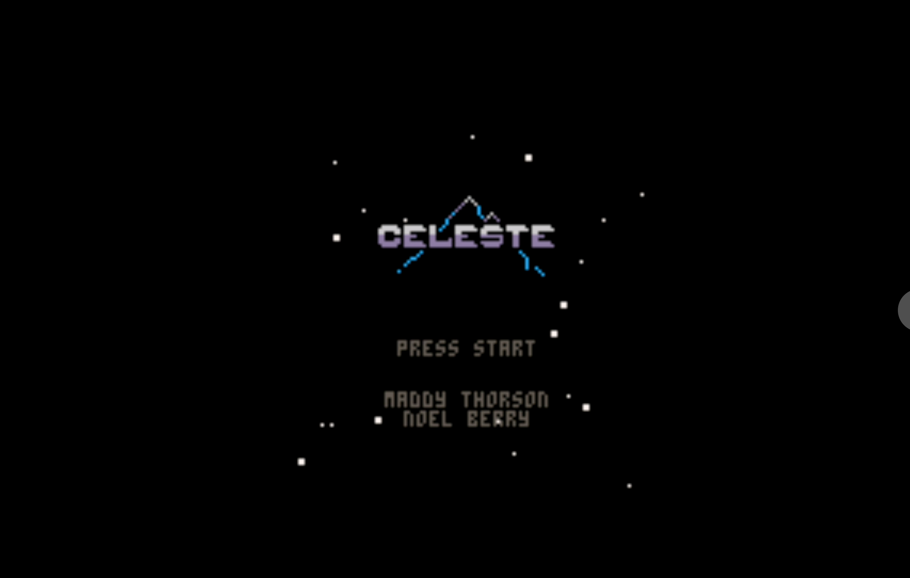

# Phase 1 — Pipeline Proof: Evidence & Notes

**Status:** Complete and verified end-to-end (2026-07-08).



The screenshot above is Celeste Classic (freely distributable homebrew GBA) running
under RetroArch on the RTX 3080 Ti (k3s-node4), encoded with hardware NVENC
(`nvh264enc`), and streamed into a plain browser tab over WebRTC via
Selkies-GStreamer. ICE connected, hardware encoder confirmed in client stats,
keyboard input verified working.

## How to run it

```bash
export KUBECONFIG=~/.kube/k3s-config
# Power on (pulls image to k3s-node4, ~ready in <1 min once cached):
kubectl -n psp-xmb scale deploy/game-session --replicas=1
kubectl -n psp-xmb rollout status deploy/game-session
# Load a game (token from the secret):
TOKEN=$(kubectl -n psp-xmb get secret psp-xmb-auth -o jsonpath='{.data.supervisor-token}' | base64 -d)
curl -X POST http://10.0.2.198:9090/game -H "Authorization: Bearer $TOKEN" \
  -H 'Content-Type: application/json' -d '{"core":"mgba","rom":"/roms/gba/celeste.gba"}'
# Play in a browser:  https://xmb.example.com  (Authelia, then basic-auth psp + password)
#   password:  kubectl -n psp-xmb get secret psp-xmb-auth -o jsonpath='{.data.basic-auth-password}' | base64 -d
# Power off:  kubectl -n psp-xmb scale deploy/game-session --replicas=0
```

`scripts/smoke-test.sh` automates the boot + load + verify sequence.

## Deviations from the original plan (all deliberate, verified)

- **Registry: Docker Hub, not GHCR.** Image ships as
  `docker.io/yourbr0ther/psp-xmb-game-session:phase1` (the plan/spec said GHCR).
  Reason: the `gh` token lacks `write:packages` and Docker Hub matches the
  cluster's existing `docker.io/yourbr0ther/*` convention. If Phase 2 wants GHCR,
  it's a one-line image-ref change in `deploy/base/game-session.yaml`.
- **ROMs come from the existing NFS library**, not an empty PVC:
  `deploy/base/roms-nfs.yaml` mounts `192.168.0.2:/mnt/user/plex` with subPath
  `ROMs/roms` (per-system folders already present: gba, snes, psp, ps, n64, …).
- **GPU device plugin not shipped here.** The cluster already runs a time-sliced
  NVIDIA device plugin managed in the `k3s_setup` repo (manifest 292). These
  manifests only *verify* GPU readiness — see `deploy/gpu/README.md`.
- **Ingress lives in `k3s_setup`**, not `deploy/`: the `xmb.example.com`
  IngressRoute (Authelia-gated) is in `k3s_setup/manifests/custom-ingressroutes.yaml`
  and its restore ConfigMap, following the cluster's Traefik-restore convention.
- **Dockerfile** needed three fixes vs. the plan's verbatim text: add
  `build-essential` (the selkies wheel builds `evdev` from source), download the
  wheel under its PEP-427 filename (pip rejects `selkies.whl`), and give nginx
  read access to `/etc/nginx/sites-available` + run workers as `psp`.

## Bugs found during live browser testing (fixed on-branch)

1. **nginx → selkies must speak HTTP/1.1.** nginx's default proxy HTTP/1.0 was
   rejected by selkies' Python websocket server, so `/turn` returned 400 and the
   client never got its ICE/TURN config. (`2e38e38`)
2. **nginx ws regex missed the trailing slash.** The client connects to
   `/webrtc/signalling/` (trailing slash); the anchored regex
   `^/(ws|webrtc/signalling)$` didn't match, so the WebSocket upgrade headers
   never applied and WebRTC hung at "connecting" forever. Fixed to
   `^/(ws|webrtc/signalling)/?$`. This was the blocker for all streaming. (`0c0f546`)
3. **Xvfb was unsupervised.** It ran backgrounded under a `sleep infinity`
   entrypoint, so an X crash left dependents crash-looping against a dead display.
   Now the entrypoint `wait`s on the Xvfb PID (so supervisord restarts it) and
   clears any stale X socket first. (`1aba52f`)

## Security / hardening deferred to Phase 2 (accepted for a LAN pipeline proof)

- **Default basic-auth `psp`/`psp`** exists in the image when env is unset; the
  k8s Deployment always injects the real password from the `psp-xmb-auth` secret,
  so the deployed pod never uses the default. Harden: drop the image default.
- **coturn `--allow-loopback-peers`** on the in-pod TURN broadens the relay's
  reach (sharpened by `hostNetwork`). Credential is random per pod start and only
  handed to authenticated browsers; ports pinned 49152–49172; LAN-only. Revisit
  when exposing remote play.
- **Supervisor API on host port 9090** is protected only by a bearer token (no
  TLS) and is reachable on the node IP on the LAN. Fine single-user/LAN; Phase 2
  should bind it to localhost or put it behind the same ingress.
- **Selkies metrics on 9081** is unauthenticated and, under `hostNetwork`, likely
  LAN-reachable. Lock down or disable in Phase 2.
- **Off-LAN remote play** is intentionally not wired (TURN not exposed off-LAN).
  The page + signaling load remotely through Authelia, but game video needs the
  relay exposed — a Phase 4 item.
- **NFS PV exports the whole `/mnt/user/plex` share RW**, scoped only by subPath.
  Consider pointing the PV `path` directly at `ROMs/roms` to shrink blast radius.
- **libretro cores are unpinned nightlies**; pin to a dated buildbot snapshot for
  reproducible rebuilds.
