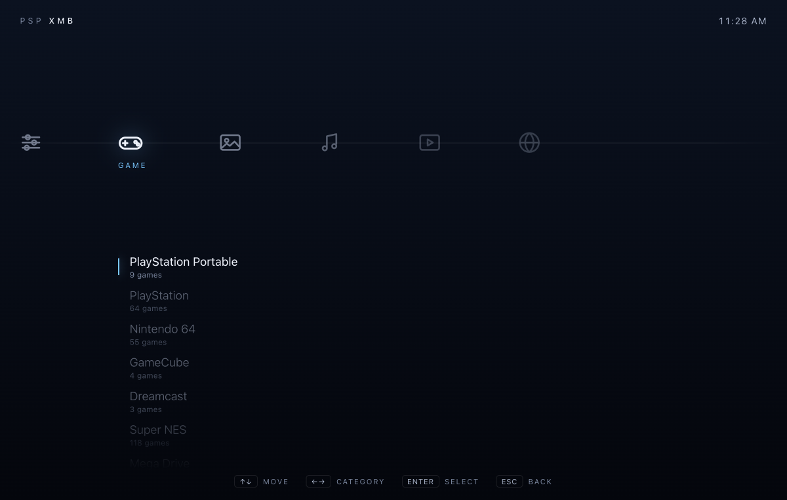
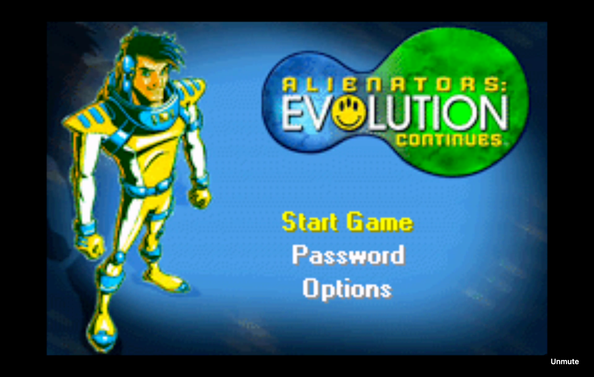
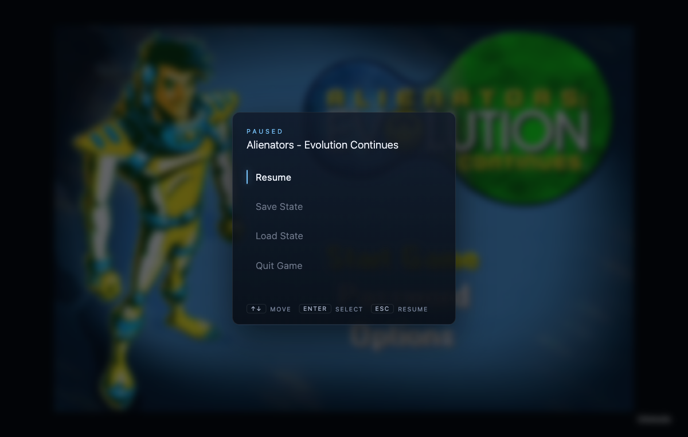

# Phase 2b step 1 (functional XMB UI) — Evidence

**Status:** Complete and verified end-to-end in a browser (2026-07-08).

| The crossbar (real library) | In-game (streaming) | Home menu |
|---|---|---|
|  |  |  |

## What was verified (Playwright against the deployed xmb-api :phase2b)

1. **PIN gate** → entered the shared token → crossbar loaded.
2. **Real library** rendered in the Game category — all 8 systems with correct counts
   (GBA 180, SNES 118, PS1 64, N64 55, PSP 9, GameCube 4, Dreamcast 3, Mega Drive 2),
   scanned live from the NFS library via `GET /api/library`.
3. **Launch through the UI** — navigated to Game Boy Advance, drilled in, selected
   "Alienators - Evolution Continues", pressed Enter. `xmb-api` scaled the
   game-session pod 0→1 and loaded the game (the "launching" flow).
4. **Stream connected in our own `<video>`** — ICE `connected`, hardware encoder,
   1920×1080, `readyState 4`, video bytes climbing; the real GBA title screen played.
   No Selkies chrome — signaling proxied same-origin through `xmb-api`, media direct
   from the node.
5. **Home menu** (Esc) overlaid Resume / Save State / Load State / Quit Game on the
   blurred paused game; **Quit** returned cleanly to the crossbar.
6. **Power off** via the Network path scaled the pod back to 0.

## Bug found + fixed during the smoke

`<Stream base="">` defeated the hook's origin default, so `new URL(path, "")`
threw "Invalid base URL" and signaling never connected. Fixed by coercing an empty
base to `window.location.origin` (commit on-branch). Re-tested → stream connects.

## Known step-1 limitations (deferred to step 2 / later)

- Visual polish: no wave shader, navigation sounds, box art, or PSP-timed eases
  (that's step 2). The styling is intentional but plain.
- Audio is video-first (peer 1); the audio peer (peer 3) is deferred.
- SessionManager boot state-desync (reports "off" if a pod is already running until
  the next action) — a Phase 2b/2c reconcile-on-boot item.
- WS `?token=` in the URL for the state socket; the Selkies signaling proxy is
  ungated (same-origin + Authelia at ingress). Documented hardening items.
